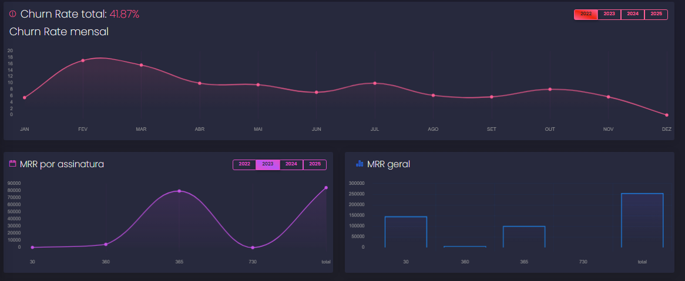

# Dashboard Copybase



> Capaz de transformar excel em gráficos com alta legibilidade, a solução para as planilhas

### Features

O projeto executa as seguintes tarefas:

- [x] Recebe um arquivo excel (.csv ou .xlsx)
- [x] Calcula o MRR (Monthly Recurring Revenue)
- [x] Calcula o Churn Rate
- [x] Mostra o Churn Rate ano a ano
- [x] Mostra o MRR mês a mês por tipo de assinatura
- [x] Mostra o número de clientes por tipo de assinatura
- [ ] Faz café

### Por baixo dos panos

O projeto em seu backend e frontend tem:

- [x] Testes unitários
- [x] Documentação
- [x] Tratamento de erros
- [x] Validação de dados
- [x] Clean code
- [ ] Desorganização e bagunça

### Stack

O projeto em seu backend e frontend foram usadas as tecnologias:

- [x] Typescript
- [x] Javascript
- [x] Vue.js
- [x] Nest.js
- [x] Chart.js
- [x] Swagger
- [x] Jest.js
- [ ] Photoshop

## 🚀 Instalando dashboard copybase

Para instalar o dashboard copybase, siga estas etapas:

> clone o repositório
> abra o repositório em sua máquina
> vá na pasta backend

```
  npm install
```
> vá na pasta frontend
```
  npm install
```
## ☕ Usando Dashboard copybase

Para usar Dashboard copybase, siga estas etapas:

> vá na pasta backend
```
  npm start
```
> vá na pasta frontend
```
  npm run dev
```
## 🧪 Testando Dashboard copybase

Para testar o Dashboard copybase, siga estas etapas:

> vá na pasta backend
```
  npm run test
```
## 📗 Documentação Dashboard copybase

Para ver a documentação do Dashboard copybase, siga estas etapas:

> vá na pasta backend
```
  npm start
```
> com backend rodando acesse
```
  http://localhost:3000/api
```

## 🤝 Colaboradores

Agradecemos às seguintes pessoas que contribuíram para este projeto:

<table>
  <tr>
    <td align="center">
      <a href="#">
        <br>
        <sub>
          <b>Luan Almeida</b>
        </sub>
      </a>
    </td>
    <td align="center">
      <a href="#">
        <br>
        <sub>
          <b>Mark Zuckerberg</b>
        </sub>
      </a>
    </td>
    <td align="center">
      <a href="#">
        <br>
        <sub>
          <b>Steve Jobs</b>
        </sub>
      </a>
    </td>
  </tr>
</table>

## 😄
